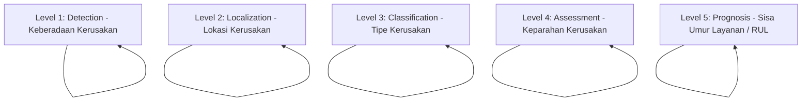

# Review & Rekomendasi Pengembangan SHM Dashboard Jembatan

> **Referensi Utama:**  
> **"Structural Health Monitoring: A Machine Learning Perspective"**  
> *Charles R. Farrar (Los Alamos National Laboratory) & Keith Worden (University of Sheffield)* — John Wiley & Sons, Ltd. (2013).

---

## 1. Pendahuluan

Dokumen ini berisi analisis, evaluasi, dan rekomendasi pengembangan untuk aplikasi **Structural Health Monitoring System (SHMS) Dashboard Jembatan**. Evaluasi ini disusun dengan membandingkan arsitektur dan fitur aplikasi saat ini terhadap prinsip-prinsip teoritis, metode pembelajaran mesin (*machine learning*), studi kasus jembatan dunia nyata, serta **8 Aksioma Utama SHM** yang dipaparkan dalam buku literatur standar oleh Charles R. Farrar dan Keith Worden (2013).

---

## 2. Ringkasan Evaluasi Sistem Dashboard Saat Ini

### 2.1 Keunggulan Aplikasi Saat Ini
Dashboard SHMS yang telah dibangun memiliki fondasi arsitektur dan antarmuka yang sangat baik:
- **Arsitektur Real-Time**: Terintegrasi dengan protokol MQTT Subscriber (`subscriber_shms.py`) dan Socket.IO (`app.py`) untuk pembaruan data secara langsung (*live streaming*).
- **Pengorganisasian Sensor Lengkap**: Memantau parameter jembatan secara komprehensif:
  - **ATRH** (Suhu & Kelembapan Udara Lingkungan)
  - **Temp** (Suhu Struktur Gelagar/Deck)
  - **Cable Stay** (Gaya, Tegangan/Stress, Suhu)
  - **Cable Tension (FFT-based)** (Frekuensi Dominan $f_1, f_2, f_3$ dan Tension $T_1, T_2, T_3, T_{avg}$)
  - **Tiltmeter** (Kemiringan Aksial X/Y dan Kalkulasi Defleksi)
  - **Strain Gauge** (Regangan Struktur $\mu\varepsilon$ dan Suhu)
  - **Anemometer (ANM2D & ANM3D)** (Kecepatan, Arah, dan Elevasi Angin)
  - **Accelerometer / Acc KDI** (Pengolahan Vibrasi & FFT Spektrum)
- **Desain UI/UX Modern**: Penggunaan amCharts 5 dengan fitur zoom, kursor interaktif, *hover bullets*, *circle blipper* (pulsing ring) pada data terbaru, skema warna *light/dark mode*, visualisasi 2D/3D lokasi sensor, serta fitur ekspor laporan (PDF/CSV).

### 2.2 Tantangan Utama Aplikasi Saat Ini
- **Level Diagnostik Terbatas**: Sebagian besar modul deteksi masih berada pada **Level 1 (Detection)** menggunakan *Fixed Static Thresholding* (nilai ambang batas batas tetap: `Warning` dan `Critical`).
- **Kerentanan Terhadap Variasi Lingkungan (EOVs)**: Belum adanya modul **Data Normalisation** untuk memisahkan fluktuasi data akibat perubahan suhu harian jembatan (*diurnal thermal variation*) atau beban lalu lintas dari indikasi kerusakan struktur yang sebenarnya.

---

## 3. Analisis Komprehensif Berdasarkan Buku Farrar & Worden (2013)

### 3.1 Evaluasi Berdasarkan Hierarki Diagnostik Rytter (Rytter Hierarchy)

Dalam Bab 1.4.8 dan Bab 9, Farrar & Worden menjelaskan 5 tingkat hierarki diagnostik SHM (Rytter, 1993):

1. **Level 1 – Detection (Detection)**:
   - *Kondisi Saat Ini*: Peringatan diaktifkan saat nilai sensor melebihi angka tertentu.
   - *Rekomendasi*: Implementasikan **Unsupervised Learning / Outlier Analysis** (seperti *Mahalanobis Squared-Distance (MSD)* atau *Shewhart $\bar{X}$ Control Chart*) untuk mendeteksi anomali tanpa tergantung pada batas statis yang kaku (Bab 10).

2. **Level 2 – Localization (Lokasi Kerusakan)**:
   - *Kondisi Saat Ini*: Menampilkan peta posisi sensor di jembatan.
   - *Rekomendasi*: Tambahkan analisis korelasi antar-sensor menggunakan **Mode Shape Curvature** atau **Modal Strain Energy** (Bab 7.9) untuk mengidentifikasi lokasi pasti gelagar jembatan yang mengalami penurunan kekakuan (*stiffness degradation*).

3. **Level 3 – Classification & Level 4 – Assessment**:
   - *Rekomendasi*: Gunakan *Supervised Machine Learning* (seperti Support Vector Machines - SVM, Multilayer Perceptron - MLP, atau Decision Trees) untuk mengklasifikasikan jenis masalah (misal: pelonggaran baut sambungan, retak fatigue, atau kabel kendur) dan mengestimasi besarnya degradasi kekakuan ($\Delta K$).

4. **Level 5 – Prognosis (Remaining Useful Life - RUL)**:
   - *Kondisi Saat Ini*: Tab *Statistik* masih dalam tahap pengembangan.
   - *Rekomendasi*: Integrasikan model **Damage Prognosis (DP)** (Bab 14) yang menggabungkan akumulasi siklus beban lalu lintas (*fatigue usage monitoring*) dengan Hukum Propagasi Retak (*Paris-Erdogan Law*) untuk mengestimasi sisa umur layanan jembatan.

---

### 3.2 Pembelajaran Penting: Variasi Lingkungan & Data Normalisation (Bab 12 & Aksioma IVb)

> ⚠️ **Aksioma IVb:** *"Without intelligent feature extraction, the more sensitive a measurement is to damage, the more sensitive it is to changing operational and environmental conditions."*

#### Pembelajaran dari Studi Kasus Jembatan Dunia Nyata dalam Buku:
1. **Jembatan I-40 (New Mexico)** (Bab 5.1 & 12.2):
   - Pemotongan gelagar baja jembatan secara sengaja (kerusakan parah) menghasilkan penurunan frekuensi alami sebesar **7%**.
   - Namun, variasi beban lalu lintas harian sendiri menyebabkan perubahan frekuensi hingga **4%**.
2. **Jembatan Alamosa Canyon (New Mexico)** (Bab 5.5 & 12.3):
   - Fluktuasi suhu udara dan perbedaan suhu pada deck jembatan (*temperature differential across deck*) dari pagi ke siang hari menyebabkan pergeseran frekuensi alami sebesar **5% – 10%**.
   - Pergeseran akibat suhu harian ini **LEBIH BESAR** daripada efek kerusakan struktural skala kecil/menengah.

#### Dampak Bagi Dashboard Anda:
Tanpa *Data Normalisation*, sensor *Cable Tension*, *Tiltmeter*, atau *Strain Gauge* akan memicu **False Alarm (Type I Error)** di siang hari akibat pemuaian jembatan oleh terik matahari.

#### Rekomendasi Solusi Data Normalisation (Bab 12):
- **Model Regresi Suhu-Frekuensi (Bab 12.5)**: Formulasikan persamaan regresi yang memprediksi frekuensi kabel ($f_1, f_2, f_3$) dan tension ($T_{avg}$) berdasarkan beda suhu struktur. Hapus efek suhu dari sinyal sebelum dievaluasi oleh sistem peringatan dini.
- **Auto-Associative Neural Network (AANN) (Bab 10.3 & 12.7.1)**: Gunakan Jaringan Saraf Tiruan bottleneck untuk mempelajari pola variasi lingkungan secara otomatis (*unsupervised*) tanpa harus mengukur semua parameter cuaca.
- **Cointegration Method (Bab 12.9)**: Terapkan teknik *cointegration* pada deret waktu non-stasioner untuk menyaring tren jangka panjang (suhu/musim) sehingga menyisakan sinyal stasioner yang murni sensitif terhadap kerusakan jembatan.

---

### 3.3 Signal Processing & Feature Extraction (Bab 7 & Appendix A)

Untuk meningkatkan fidelitas data sensor di dashboard, beberapa metode ekstraksi fitur berikut direkomendasikan:

1. **Modal Assurance Criterion (MAC) & COMAC (Bab 7.8.5)**:
   - Kalkulasi indeks korelasi ragam getar (**MAC Index** $0.0 - 1.0$) antara kondisi jembatan real-time dengan kondisi baseline sehat.
   - Penurunan nilai MAC di bawah 0.95 menjadi indikator kuat perubahan integritas dinamik jembatan.
2. **Temporal Moments (Bab 7.3)**:
   - Hitung momen waktu sinyal vibrasi: *Energy* ($E$), *Centroid* ($T$), dan *RMS Duration* ($D$) untuk mendeteksi kejutan beban (*transient load*) secara akurat.
3. **Statistik Sinyal Tingkat Lanjut (Bab 7.2)**:
   - Tampilkan **Kurtosis** (sensitif terhadap getaran impact/kejutan baut), **Skewness** (sensitif terhadap respon asimetris retak yang membuka-tutup / *breathing crack*), dan **Crest Factor / K-Factor** pada halaman analisis vibrasi.

---

## 4. Matriks Rekomendasi Peningkatan Dashboard (Roadmap)

| Modul Dashboard | Fitur Saat Ini | Rekomendasi Improvement | Dampak / Manfaat |
|---|---|---|---|
| **Alarm & Alerting System** | Fixed Static Thresholds (`WARN` & `CRITICAL`) | **Statistical Process Control (SPC)** & **Mahalanobis Outlier Analysis** (Bab 6 & 10) | Menghilangkan *False Alarm* akibat variasi cuaca/suhu dan fluktuasi statistik normal. |
| **Kompensasi Lingkungan** | Data mentah tanpa pembacaan kompensasi suhu | **Data Normalisation (Regresi Suhu & Cointegration)** (Bab 12) | Menjamin peringatan dini murni disebabkan oleh kerusakan fisik jembatan, bukan karena matahari siang. |
| **Fitur Analisis Frekuensi (Kabel & Vibrasi)** | $f_1, f_2, f_3$ & $T_{avg}$ standar | **Modal Assurance Criterion (MAC)** & **Mode Shape Curvature** (Bab 7.8 & 7.9) | Mampu mendeteksi lokasi pasti penurunan kekakuan (*stiffness reduction*) pada gelagar jembatan. |
| **Ringkasan Kesehatan (Executive Summary)** | Status per sensor individual | **Multi-Sensor Data Fusion (Bridge Health Index - BHI)** (Bab 4.16 & 9.3) | Memberikan skor kesehatan jembatan terintegrasi (0-100%) untuk pengambil keputusan (Kementerian PUPR/Pengelola). |
| **Tab Statistik (Kabel / Vibrasi)** | Status *"Coming Soon"* | **Damage Prognosis & RUL Estimation** (Bab 14) | Memberikan estimasi sisa umur layanan jembatan (*Remaining Useful Life*) untuk perencanaan *Condition-Based Maintenance*. |

---

## 5. Panduan Implementasi Teknis (Step-by-Step)

### Tahap 1: Kompensasi Suhu pada Kabel & Strain (Jangka Pendek)
1. Pada backend Python (`stats_service.py` / `cable_tension.py`), buat fungsi kalkulasi residu suhu:
   $$\text{Residu } T_{avg} = T_{avg} - (a \cdot \text{Temp} + b)$$
2. Tampilkan kurva residu ini pada grafik. Peringatan dini (*Warning*) hanya diaktifkan jika nilai residu melampaui batas $3\sigma$ ($3 \times \text{Standard Deviation}$).

### Tahap 2: Integrasi Matriks MAC pada Vibrasi (Jangka Menengah)
1. Simpan vektor modal baseline jembatan saat kondisi sehat di database PostgreSQL.
2. Hitung nilai MAC secara berkala setiap jam dari data FFT Accelerometer.

### Tahap 3: Modul Prognosa Sisa Umur (Jangka Panjang)
1. Gunakan data akumulasi tegangan (*Strain*) untuk menghitung siklus beban (*fatigue cycle counting* / *Rainflow counting*).
2. Terapkan persamaan *Paris-Erdogan* untuk memprediksi akumulasi retak fatigue pada sambungan baja jembatan.

---

## 6. Kesimpulan

SHMS Dashboard Jembatan yang telah Anda kembangkan memiliki arsitektur perangkat lunak, visualisasi real-time, dan manajemen sensor yang **sangat kuat dan modern**. 

Dengan mengimplementasikan **Data Normalisation (Kompensasi Suhu)**, **Statistical Outlier Detection (SPC)**, dan **Bridge Health Index (BHI)** berbasis referensi *Farrar & Worden (2013)*, aplikasi ini akan bertransformasi dari sekadar alat pemonitor data mentah menjadi **Sistem Peringatan Dini & Diagnostik SHM Jembatan Tingkat Lanjut (*Intelligent Structural Health Monitoring System*)** yang handal dan memenuhi standar internasional.
